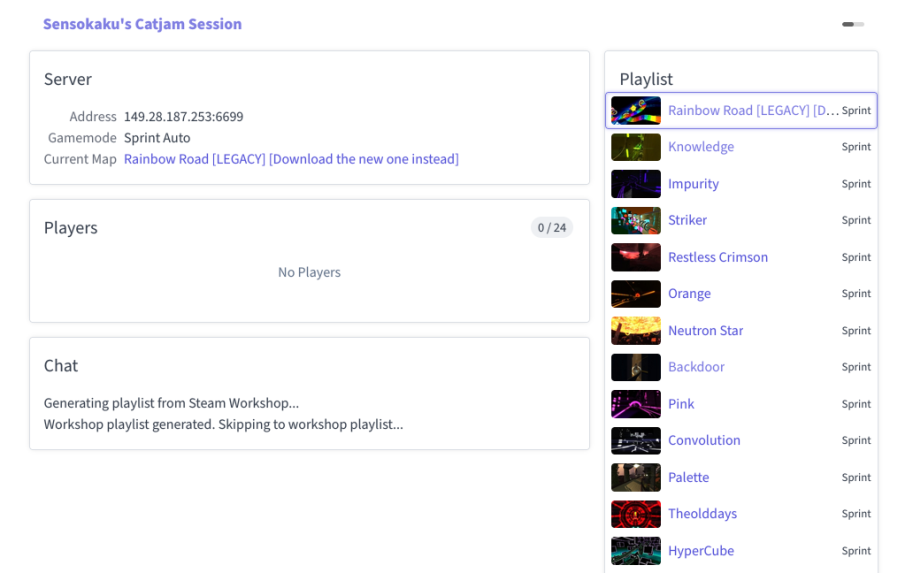

# distant-front

Web frontend for Distance (the game). Doesn't require JavaScript for the most
part.

## Usage

1. `go install github.com/diamondburned/distant-front`
2. Copy `.env` from this repository and edit it appropriately (or use
   environment variables).
3. Use systemd or your favorite service manager to run.
